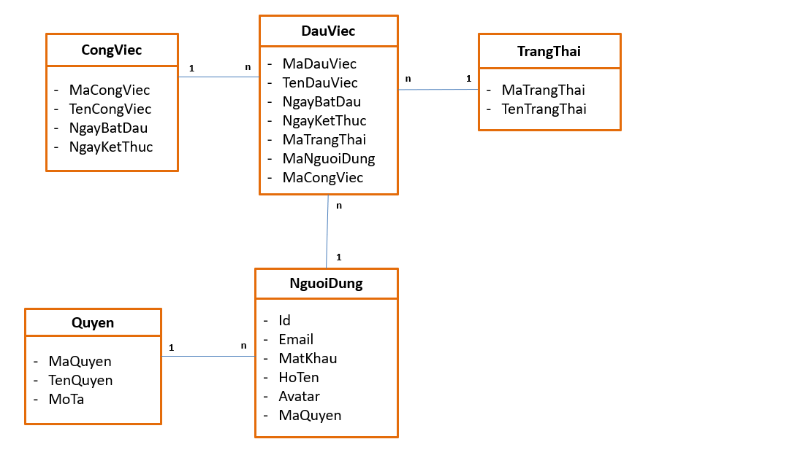

# Dự Án CRM

Java09 CRM (Customer Relationship Management) Home Work

## Yêu Cầu Hệ Thống

### Xây dựng hệ thống CRM quản lý công việc nhân viên công ty với các yêu cầu:

- Hệ thống cho phép quản trị hệ thống (ADMIN) đăng nhập và thêm mới, sửa, xóa, xem thông tin, cấp quyền cho nhân viên.
- Hệ thống đảm bảo cho “quản lý dự án” (LEADER) có thể dễ dàng đăng nhập thêm mới, sửa, xóa, xem thông tin dự án. Đồng thời có thể thêm nhân viên vào dự án và phân công công việc cho từng nhân viên thuộc dự án.
- Hệ thống cũng cho phép “quản lý dự án” có thể theo dõi các thống kê về tiến độ công việc của từng nhân viên trong mỗi dự án.
- Hệ thống cho phép nhân viên đăng nhập với tư cách thành viên, cập nhật tiến độ công việc. Xem các thống kê về tiến độ của các việc đã và đang thực hiện.
- Hệ thống cũng cho phép quản trị hệ thống xem các thống kê về tiến độ các dự án.

## Phân Tích Hệ Thống

### Loại người dùng (quyền)

- **Quản trị hệ thống** (Admin): Người dùng có toàn quyền đối với hệ thống, có thể thêm, sửa, xóa, xem thông tin và cấp quyền cho các thành viên khác, xem thống kê về tất cả các dự án.
- **Quản lý dự án** (Leader): Xem danh sách nhân viên của công ty, thêm, sửa, xóa, xem thông tin dự án do mình quản lý, ngoài ra có thể thêm hoặc loại bỏ người dùng là nhân viên thường vào dự án, phân công công việc và xem thống kê về dự án thuộc về mình.
- **Nhân Viên** (Member): Người dùng chỉ có quyền xem các công việc được giao trong mỗi dự án, cập nhật tiến độ công việc được giao, xem thống kê tiến độ các dự án của bản thân.

### Các module:

- **Quản lý quyền**: Các thông tin như tên quyền, mô tả.
- **Quản lý người dùng**: Các thông tin như email, mật khẩu, họ tên, địa chỉ, số điện thoại, loại thành viên (quyền).
- **Quản lý dự án**: Các thông tin như tên dự án, mô tả, ngày bắt đầu, ngày kết thúc, mã người dùng (người tạo dự án).
- **Quản lý công việc**: Các thông tin như tên công việc, mô tả, ngày bắt đầu, ngày kết thúc, mã người dùng(người thực hiện), mã dự án (thuộc dự án nào), mã trạng thái (chưa bắt đầu, đang thực hiện, đã hoàn thành).

### Phân tích công việc:

#### Quản lý quyền:

1. Đăng nhập

- Thực hiện chức năng đăng nhập.
  - AuthController: Dùng jbcrypt kiểm tra mật khẩu.
  - login.jsp
- Cấu hình session.
  - UserLoginDto
  ```
  {
      id: [int],
      fullname: [String],
      rolename: [String]
  }
  ```

2. Tạo filter cho các URL theo phân quyền

| URL_PATTERNS |     ROLE_ADMIN     |    ROLE_MANAGER    |     ROLE_USER      |
| ------------ | :----------------: | :----------------: | :----------------: |
| /home        | :heavy_check_mark: | :heavy_check_mark: | :heavy_check_mark: |
| /login       |                    |                    |                    |
| /logout      |                    |                    |                    |
| /user        | :heavy_check_mark: | :heavy_check_mark: |        :x:         |
| /user/edit   | :heavy_check_mark: | :heavy_check_mark: | :heavy_check_mark: |
| /user/add    | :heavy_check_mark: |        :x:         |        :x:         |
| /user/remove | :heavy_check_mark: |        :x:         |        :x:         |
| /user/info   | :heavy_check_mark: | :heavy_check_mark: | :heavy_check_mark: |
| /role        | :heavy_check_mark: |        :x:         |        :x:         |
| /role/add    | :heavy_check_mark: |        :x:         |        :x:         |
| /role/edit   | :heavy_check_mark: |        :x:         |        :x:         |
| /role/remove | :heavy_check_mark: |        :x:         |        :x:         |
| /job         | :heavy_check_mark: | :heavy_check_mark: |        :x:         |
| /job/edit    | :heavy_check_mark: | :heavy_check_mark: |        :x:         |
| /job/add     | :heavy_check_mark: | :heavy_check_mark: |        :x:         |
| /job/remove  | :heavy_check_mark: | :heavy_check_mark: |        :x:         |
| /job/info    | :heavy_check_mark: | :heavy_check_mark: |        :x:         |
| /task        | :heavy_check_mark: | :heavy_check_mark: | :heavy_check_mark: |
| /task/edit   | :heavy_check_mark: | :heavy_check_mark: | :heavy_check_mark: |
| /task/add    | :heavy_check_mark: | :heavy_check_mark: | :heavy_check_mark: |
| /task/remove | :heavy_check_mark: | :heavy_check_mark: | :heavy_check_mark: |

#### Quản lý người dùng:

1. Tạo UserController (quản lý get & post request).
2. Tạo UserService (kiểm tra ROLE, thực hiện xử lý nghiệp vụ).
3. Tạo UserRepository (lấy dữ liệu, xóa dữ liệu).
4. Tạo các file entity và dto tương ứng.
5. Tạo các file UI: index.jsp, add.jsp, edit.jsp

**Chú ý**:

ROLE_USER: không được thay đổi role.

#### Quản lý dự án:

1. Tạo JobController (quản lý get & post request).
2. Tạo JobService (Kiểm tra ROLE, thực hiện xử lý).
3. Tạo JobRepository (lấy dữ liệu, xóa dữ liệu).
4. Tạo các file entity và dto tương ứng.
5. Tạo các file UI: index.jsp, add.jsp, edit.jsp, info.jsp

**Chú ý**:

_info.jsp_: Hiển thị thống kê thông tin dự án

#### Quản lý công việc:

1. Tạo TaskController (quản lý get & post request).
2. Tạo TaskService (Kiểm tra ROLE, thực hiện xử lý).
3. Tạo TaskRepository (lấy dữ liệu, xóa dữ liệu).
4. Tạo các file entity và dto tương ứng.
5. Tạo các file UI: index.jsp, add.jsp, edit.jsp, info.jsp (không cần xem info của công viêc)

**Chú ý**:

- ROLE_USER: chỉ thấy được quản lý công việc của bản thân.

## Use Case

### Quản trị viên(admin)

1. Đăng nhập hệ thống
2. Quản lý tài khoản cá nhân
3. Quản lý dự án
4. Quản lý công việc
5. Quản lý quyền
6. Quản lý tất cả thành viên

### Quản lý dự án(leader)

1. Đăng nhập hệ thống
2. Quản lý tài khoản cá nhân
3. Quản lý dự án
4. Quản lý thành viên dự án
5. Xem danh sách tất cả nhân viên

### Thành viên(member)

1. Đăng nhập hệ thống
2. Quản lý tài khoản cá nhân
3. Cập nhật tiến độ công việc
4. Xem thống kê công việc (cá nhân)

## Database

**MySQL Script**

```
USE crm;

CREATE TABLE IF NOT EXISTS roles (
    id INT NOT NULL AUTO_INCREMENT,
    name VARCHAR(50) NOT NULL,
    description VARCHAR(100),
    PRIMARY KEY (id)
);

CREATE TABLE IF NOT EXISTS users (
    id INT NOT NULL AUTO_INCREMENT,
    email VARCHAR(100) NOT NULL,
    password VARCHAR(100) NOT NULL,
    fullname VARCHAR(100) NOT NULL,
    avatar VARCHAR(100),
    role_id INT NOT NULL,
    PRIMARY KEY (id)
);

CREATE TABLE IF NOT EXISTS status (
    id INT NOT NULL AUTO_INCREMENT,
    name VARCHAR(50) NOT NULL,
    PRIMARY KEY (id)
);

CREATE TABLE IF NOT EXISTS jobs (
    id INT NOT NULL AUTO_INCREMENT,
    name VARCHAR(50) NOT NULL,
    start_date TIMESTAMP,
    end_date TIMESTAMP,
    PRIMARY KEY (id)
);

CREATE TABLE IF NOT EXISTS tasks (
    id INT NOT NULL AUTO_INCREMENT,
    name VARCHAR(50) NOT NULL,
    start_date TIMESTAMP,
    end_date TIMESTAMP,
    user_id INT NOT NULL,
    job_id INT NOT NULL,
    status_id INT NOT NULL,
    PRIMARY KEY (id)
);

ALTER TABLE users ADD FOREIGN KEY (role_id) REFERENCES roles (id)  ON DELETE CASCADE;
ALTER TABLE tasks ADD FOREIGN KEY (user_id) REFERENCES users (id)  ON DELETE CASCADE;
ALTER TABLE tasks ADD FOREIGN KEY (job_id) REFERENCES jobs (id)  ON DELETE CASCADE;
ALTER TABLE tasks ADD FOREIGN KEY (status_id) REFERENCES status (id)  ON DELETE CASCADE;

INSERT INTO roles( name, description ) VALUES ("ROLE_ADMIN", "Quản trị hệ thống");
INSERT INTO roles( name, description ) VALUES ("ROLE_MANAGER", "Quản lý");
INSERT INTO roles( name, description ) VALUES ("ROLE_USER", "Nhân viên");

INSERT INTO status( name ) VALUES ("Chưa thực hiện");
INSERT INTO status( name ) VALUES ("Đang thực hiện");
INSERT INTO status( name ) VALUES ("Đã hoàn thành");


<!-- TIMESTAMP
    Lưu trữ cả hai thông tin ngày tháng và thời gian.
    Giá trị này sẽ được chuyển đổi từ múi giờ hiện tại sang UTC trong khi lưu trữ,
    và sẽ chuyển trở lại múi giờ hiện tại khi lấy dữ liệu ra.
 -->
```



### Docker Setup

1. Pull Mysql image

```
docker pull mysql
```

2. Save mysql config file to host folder

- Host dir: E:\ProgramWorkspace\Docker\mysql_dir\
- Container dir: /home/mysql_dir
- Config file dir: /etc/mysql/my.cnf

```
<--! docker run [remove after run] [mount disk] [host_dir]:[container_dir] [image] cp [config_dir] [container_dir] -->

docker run --rm -v E:\ProgramWorkspace\Docker\mysql_dir\:/home/mysql_dir mysql cp /etc/mysql/my.cnf /home/mysql_dir
```

3. Edit the "my.cnf" to add native authentication

- Add "default-authentication-plugin=mysql_native_password" to the end of "my.cnf"
- **my.cnf**

```
[mysqld]
pid-file        = /var/run/mysqld/mysqld.pid
socket          = /var/run/mysqld/mysqld.sock
datadir         = /var/lib/mysql
secure-file-priv= NULL

# Custom config should go here
!includedir /etc/mysql/conf.d/

default-authentication-plugin=mysql_native_password
```

4. Create a folder on host machine to store the data

```
mkdir E:\ProgramWorkspace\Docker\mysql_dir\db
```

5. Run Mysql container

```
<--! docker run -e MYSQL_ROOT_PASSWORD=[value] -v [my.cnf host dir]:[my.cnf container dir] -v [db folder host dir]:[db container dir] --name [container name] -p [host_port]:[container_port] [image] -->

docker run -e MYSQL_ROOT_PASSWORD=admin -v E:\ProgramWorkspace\Docker\mysql_dir\my.cnf:/etc/mysql/my.cnf -v E:\ProgramWorkspace\Docker\mysql_dir\db:/var/lib/mysql --name b-mysql -p 3306:3306 mysql
```

6. User Mysql Workbench to connect database as usual
